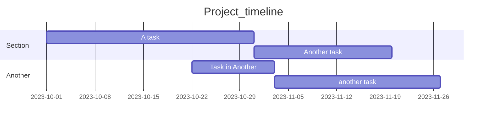

# ADM-TP1
pour versionner le fichier tex du rapport du DM.

```mermaid
gantt
    title Project_timeline
    dateFormat YYYY-MM-DD
    section Section
        A task          :a1, 2023-10-01, 30d
        Another task    :after a1, 20d
    section Another
        Task in Another :2023-10-22, 12d
        another task    :24d
```

```mermaid
graph TD;
A-->B;
A-->C;
B-->D;
C-->D;
```
